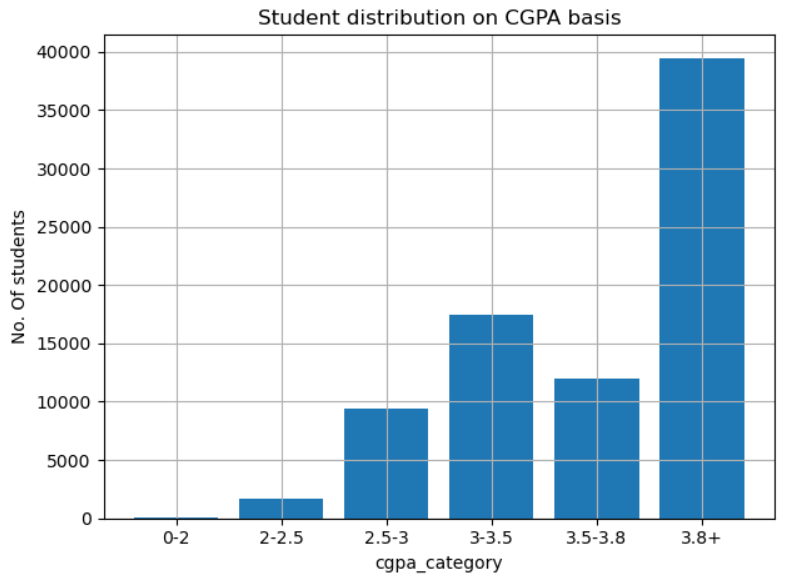
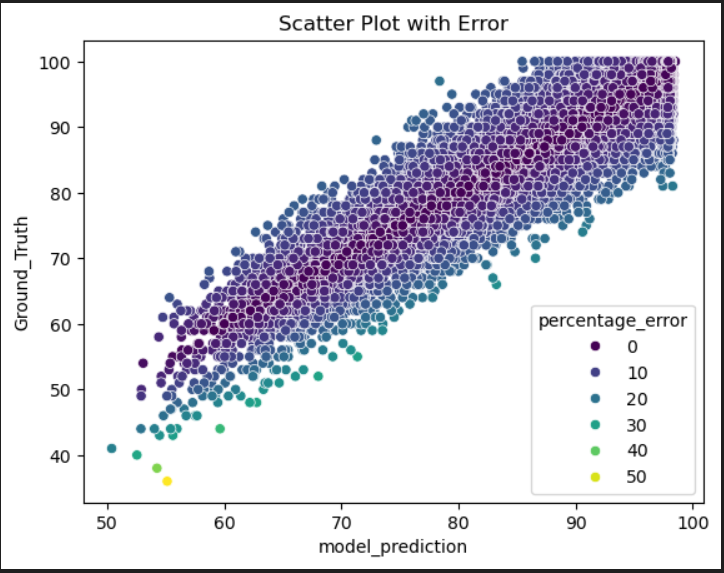
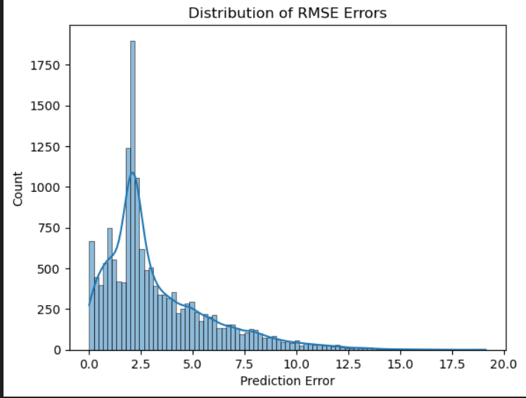
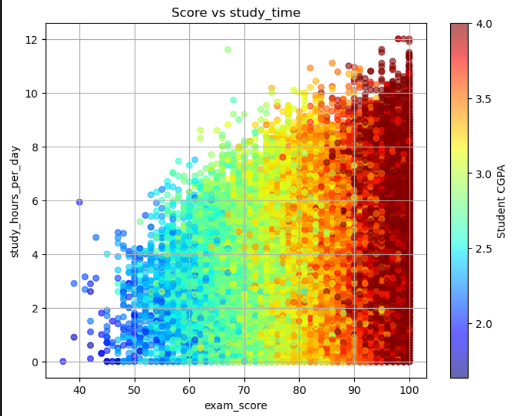

# 📊 Student Exam Score Prediction

This project was inspired by Chapter 2 of Aurélien Géron's Hands-On Machine Learning with Scikit-Learn, Keras & TensorFlow, where he performs detailed analysis on the Housing dataset. Motivated by that, I explored and applied similar machine learning techniques on the Student Habits and Academic Performance dataset to predict exam scores.

## 📁 Dataset

- **Source**: [Kaggle - Student Habits and Academic Performance Dataset](https://www.kaggle.com/datasets/aryan208/student-habits-and-academic-performance-dataset)
- **Description**: Includes student habits, demographics, and academic indicators.
- **Target**: `exam_score`

## 🚀 Objective

Build and evaluate a regression model/Random Forest Model  that can accurately predict a student’s exam score based on their habits and academic traits.

## 🧠 Features Included

- **student_id**: Unique identifier for each student.  
- **age**: Age of the student (ranging from 16 to 28 years).  
- **gender**: Gender identity (Male, Female, or Other).  
- **major**: Student’s field of study (e.g., Computer Science, Engineering, Arts).  
- **study_hours_per_day**: Average number of hours spent studying daily.  
- **social_media_hours**: Daily time spent on social media platforms.  
- **netflix_hours**: Daily time spent watching Netflix or similar streaming services.  
- **screen_time**: Total daily screen time across devices.  
- **part_time_job**: Indicates if the student holds a part-time job (Yes/No).  
- **attendance_percentage**: Academic attendance rate as a percentage.  
- **sleep_hours**: Average hours of sleep per night.  
- **exercise_frequency**: Frequency of physical exercise (e.g., times per week).  
- **diet_quality**: Qualitative rating of diet (e.g., poor, average, good).  
- **mental_health_rating**: Self-assessed mental health on a scale from 1 to 10.  
- **stress_level**: Perceived stress level on a scale from 1 to 10.  
- **exam_anxiety_score**: Anxiety level related to exams on a scale from 1 to 10.  
- **extracurricular_participation**: Involvement in extracurricular activities (Yes/No).  
- **access_to_tutoring**: Whether the student has access to tutoring support (Yes/No).  
- **family_income_range**: Family income category (e.g., low, medium, high).  
- **parental_support_level**: Level of parental support (qualitative or numeric scale).  
- **parental_education_level**: Highest education level attained by parents.  
- **motivation_level**: Self-reported motivation on a scale from 1 to 10.  
- **time_management_score**: Effectiveness in managing time, rated 1 to 10.  
- **learning_style**: Preferred learning method (e.g., visual, auditory, kinesthetic).  
- **study_environment**: Typical study location (e.g., home, library, café).  
- **dropout_risk**: Binary indicator (Yes/No) derived from stress and motivation levels.  
- **previous_gpa**: GPA from previous semesters or years.  
- **exam_score**: Target variable — student’s exam score to be predicted.

## 🧪 Pipeline Steps

- Data Exploration and Cleaning
- Feature Engineering
- Pipelines with Custom Transformers
- Model Training (Linear Regression, Random Forest, etc.)
- Hyperparameter Tuning (GridSearchCV)
- Evaluation using RMSE and Error Percentage
- Visualizations using Seaborn & Matplotlib

## 📈 Key Visualizations

- Scatter plots with color-coded percentage error
- Distribution of predicted vs actual scores
- Correlation heatmaps

## Visualizations

Here are some key plots from the project:

  
*Distribution of CGPA among students.*

  
*Comparison of predicted exam scores vs actual scores.*

  
*Distribution of Root Mean Squared Errors across predictions.*

  
*Relationship between study time and exam scores.*

## 📚 Tools Used

- Python (Pandas, NumPy, Scikit-learn)
- Jupyter Notebook
- Seaborn, Matplotlib
- GridSearchCV for hyperparameter tuning

## 🗂️ Project Structure

├── student_exam_prediction.ipynb
├── data/
│ └── student_data.csv
├── images/
│ └── visualizations.png
├── requirements.txt
└── README.md

## 💡 Results

Best RMSE achieved: X.XX
Error % ranged between: A% - B%

## 📬 Contact
For questions or suggestions, feel free to reach out:
Akshat Khatri
📧 akshatkhatri.dev@gmail.com

